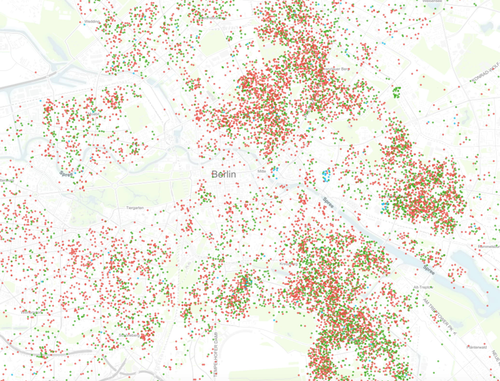

```{r echo=FALSE, warning=FALSE, message=FALSE}
knitr::opts_chunk$set(echo = FALSE)

library(ggplot2)
library(plm)
library(stargazer)
library(scales)
library(zoo)

# Set working directory
try(setwd("/Users/Paulo/GitHub/FinalPaper/presentation"),silent=TRUE)
try(setwd("/Users/djm113/Documents/GitHub/FinalPaper/presentation"),silent=TRUE)

```

```{r echo=FALSE, warning=FALSE, message=FALSE, cache=TRUE}

# Dynamical Link to Data/Packages R script file (takes some time!)
source("/Users/Paulo/GitHub/FinalPaper/code/finalpaper_analysis.R")

```

## Airbnb in Berlin

>- 20,000+ Berliners hosted more than half a million guests in 2015

>- Renting out flats as a source of income has become more and more popular.

>- "Zweckentfremdungsverbot" law was passed in May 2014 but only came into force in April 2016.

## Airbnb in Berlin  {.flexbox .vcenter}

<br>
<figcaption> Source: www.insideairbnb.com </figcaption>

## Evidence from Literature
>- **Airbnb drives up rent:** @schafer2016misuse found that rent growth is higher in neighbourhoods that have a significant number of misused flats.

>- **Effect on the hotel industry:** @guttentag2015airbnb estimates that Airbnb sold about 15 million room nights in 2012.

>- **Evidence from Texas:** @zervas2016rise found that a 10 percent size increase of the Airbnb market in Texas resulted in a .39 percent decrease in hotel revenue.

## Research Question & Hypothesis {.build .flexbox .vcenter .bigger}

<center>
**What is the effect of Airbnb on Hotels in Berlin?**
<br>
<br>
*The higher the Airbnb supply in a given district in Berlin, the greater the negative effect on the hotel industry in that same district.*
</center>

## Data Sources {.build}

Our paper uses data from various sources for the period of 2010 to 2014: 

- **Statistical Information System Berlin/Brandenburg** (SBB)

- **Federal Statistical Office and the statistical offices of the Länder** (FSO)

- **InsideAirbnb.com**

- **Eurostat**

## Main Variables

Dependent variable: 

$${Occupancy Rate}_{it} =  \frac {{Overnight Stays}_{it}}{{Hotel Beds}_{it}*{days}_{t}}$$

Main independent variables: 

1. **Airbnb Supply:** Cumulative sum of new listings

2. **Dynamic Airbnb Supply:**  Active listings based on reviews


## Airbnb Listings per Neighbourhood (static model) (2010 - 2014)
```{r, echo=FALSE, fig.height=5, fig.width=9}

analysis_simple$ymym <- as.yearmon(analysis_simple$year_month)

ggplot(analysis_simple, aes(x=ymym, y=AB_supply, group=neighbourhood, colour=neighbourhood)) +
    geom_line(alpha=0.7) + 
    labs(x="Months", y="Number of Airbnb Listings") + 
    scale_colour_discrete(name ="Neighbourhood") +
    scale_x_yearmon(as.yearmon(analysis_simple$ymym), format = "%Y-%m", n = 6)

```

## Airbnb Listings per Neighbourhood (dynamic model) (2010 - 2014)
```{r, echo=FALSE, fig.height=5, fig.width=9}

danalysis_simple$ymym <- as.yearmon(danalysis_simple$year_month)

ggplot(danalysis_simple, aes(x=ymym, y=AB_supply, group=neighbourhood, colour=neighbourhood)) +
    geom_line(alpha=0.7) + 
    scale_x_yearmon(as.yearmon(analysis_simple$ymym), format = "%Y-%m", n = 6) +
    labs(x="Months", y="Number of Airbnb Listings") + 
    scale_colour_discrete(name ="Neighbourhood") 

```

## Effect of Increase in Airbnb Listings on Berlin Hotel Occupancy Rates (2010 - 2014)
```{r, echo=FALSE, fig.height=4, fig.width=8}
marketentry_dynamic <- subset(danalysis_simple, danalysis_simple$dmarketentry==1)
marketentry_static <- subset(analysis_simple, analysis_simple$dmarketentry==1)

ggplot(marketentry_dynamic, aes(x=log_ABsupply, y=occup_rate)) +
    geom_point(alpha=0.5, color="#c0392b") +
    geom_smooth(method = "lm", se = FALSE, color="black", fill="black") +
    labs(x="Log Number of Airbnb Listings", y="Hotel Occupance Rate")
```

##Regression Model
Fixed Effects (for time and district) to account for unobserved heterogeneity:

<div class="centered">

${\log Occupancy Rate}_{it} = \beta _i * \log AbbSupply_{it} + \beta _j * X' + \tau _i + \varepsilon _{it}$

</div>

${X'}$: Control variables (UE rate, average HH income, passengers arriving in Berlin)

${\tau _i}$: Time and district dummies

##Estimation Results {.flexbox .vcenter .reduced}

``` {r, echo = FALSE, include=TRUE, message = FALSE, error = FALSE, results = "asis"}

ModelI <- LMIII(analysis_simple$occup_rate, analysis_simple)

ModelII <- FEI(analysis_simple$occup_rate, analysis_simple)

ModelIII <- FEIIm(analysis_simple$occup_rate, analysis_simple)

stargazer(ModelI, ModelII, ModelIII,
          digits = 3, 
          covariate.labels = c("Log Airbnb Listings", "Average HH Income (Log)", "Unemployment Rate", "Incoming Passengers", "Market Entry"),
          omit = c("NID", "factor_ym"),           
          omit.stat = c('f', 'ser'), # to nicely fits on the page
          omit.labels = c("Neighbourhood-specific trend", "Time trend"), 
          dep.var.labels = c("Occupancy Rate"),
          out.header = FALSE, 
          model.names = FALSE,
          header = FALSE,
          add.lines = list(c('District/Time FE?', c('No', "Yes", "Yes"))),
          align = TRUE,
          type = "html")

```

## Prelimenary Conclusion
- Test

## {.flexbox .vcenter .bigger}
**Thank you!**
<br>
<br>
<br>
*Questions?*

##Further Readings {.smaller}
